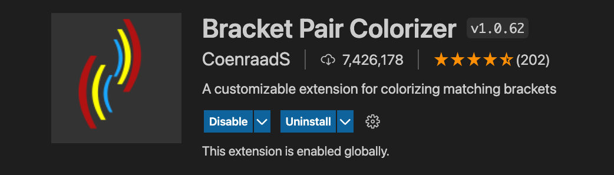
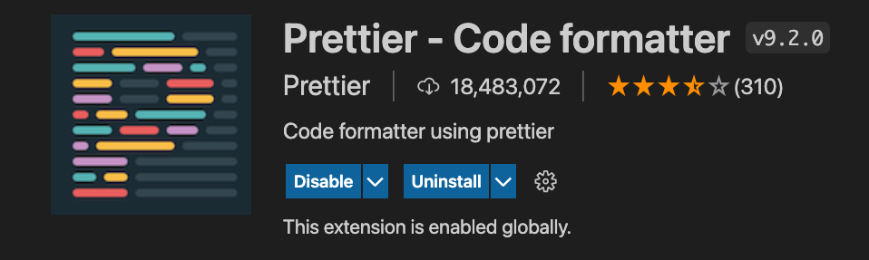
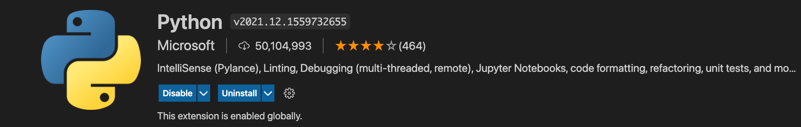
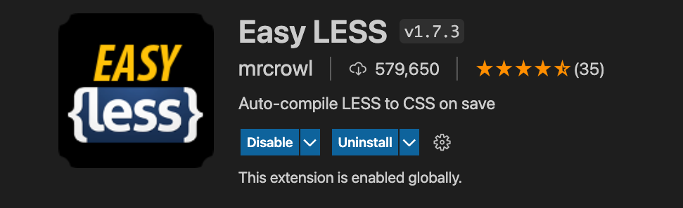
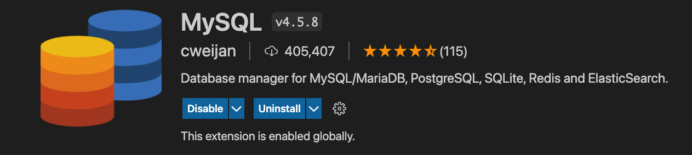

# week1session1

Know how to run a python file on your device.  There are 3 main ways - python, python3, and py  

How to enter a terminal shell and how to exit the shell

Mutable vs immutable

# Good VS Code Extentions to install:

